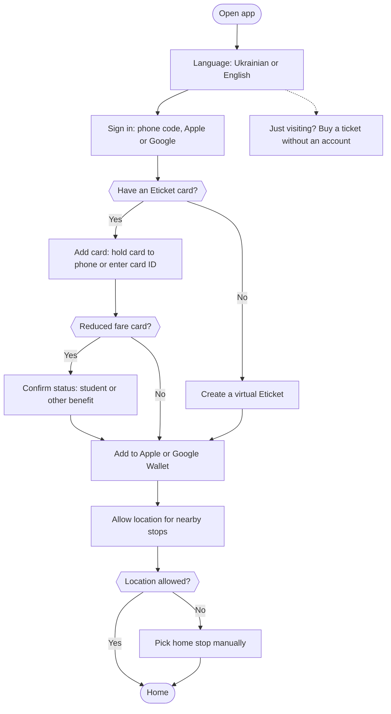
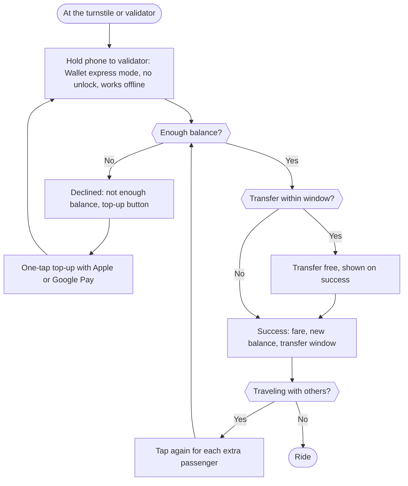
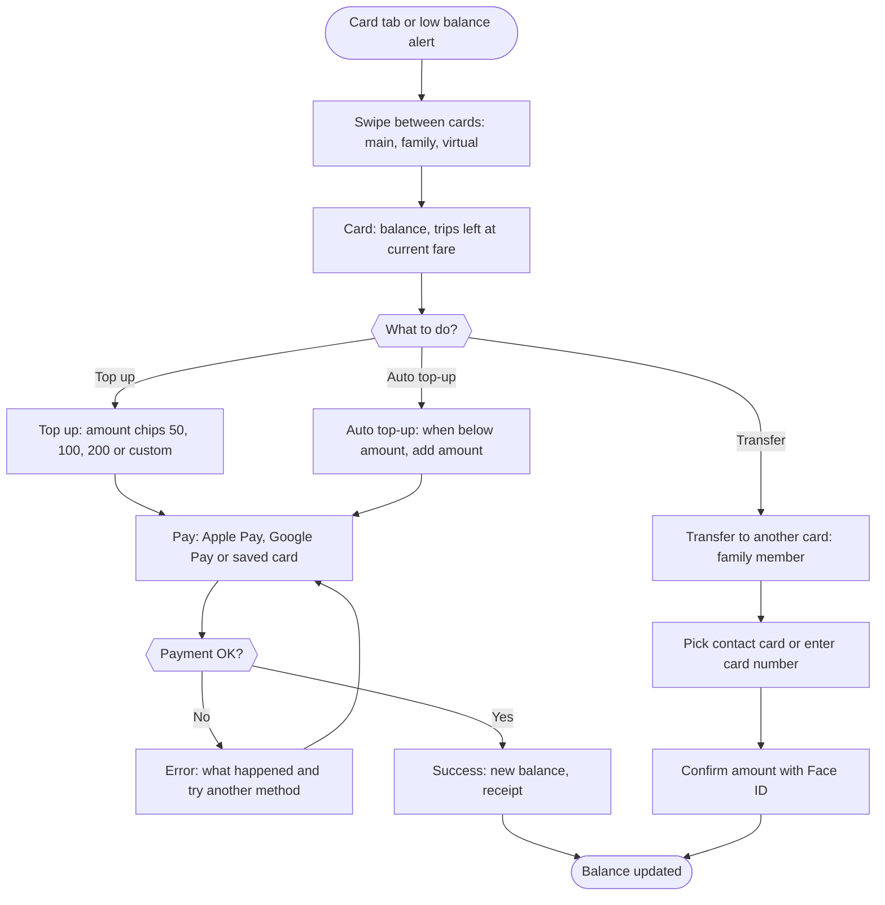
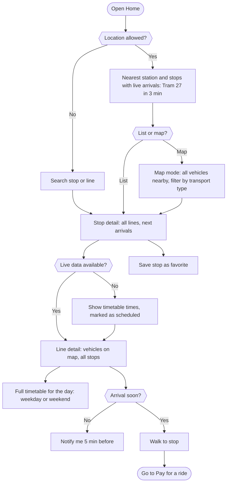
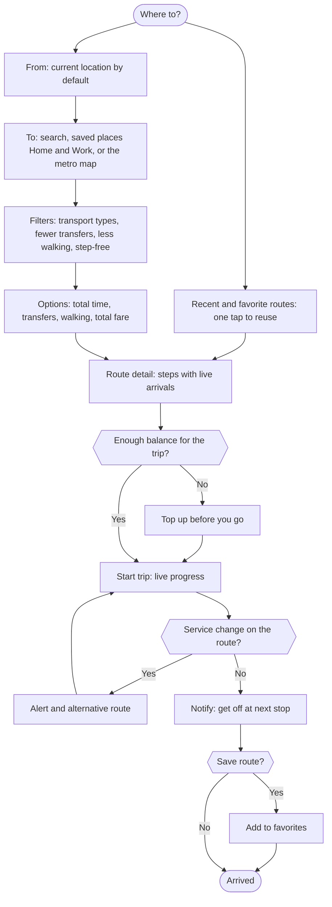
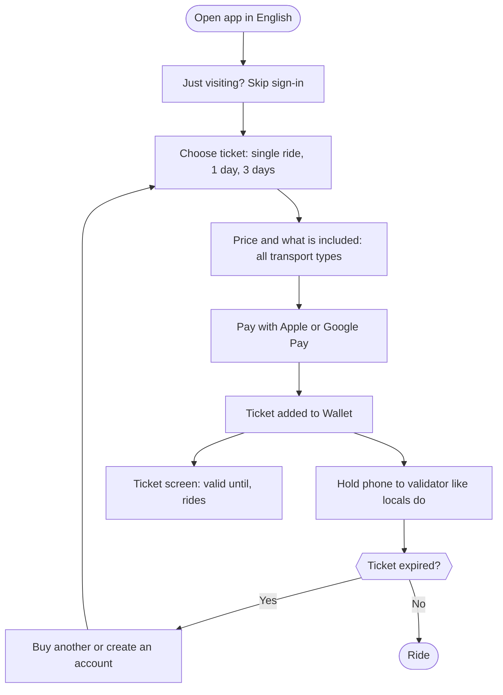
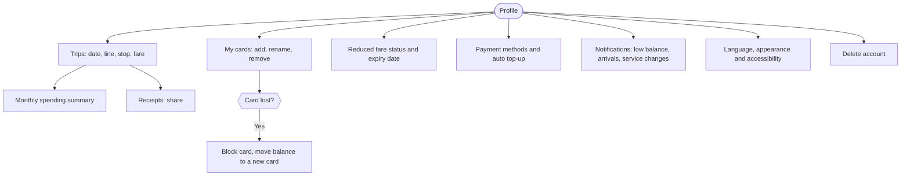
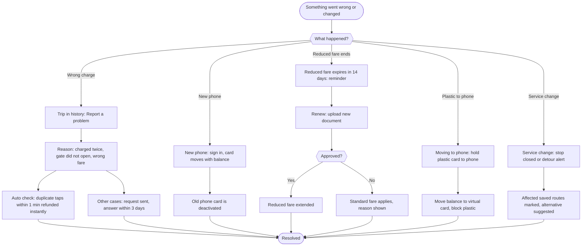

# Eticket user flows (from the Miro board "Eticket redesign 2026: user flows")

Board: https://miro.com/app/board/uXjVHhQTOfI=/
Legend: yellow = steps, blue = decisions, green = start and end.

## 1. Onboarding

## 2. Pay for a ride

## 3. Cards, top-up, auto top-up and transfer

## 4. Nearby, live arrivals, map and timetable

## 5. Route from A to B

## 6. Visitor: ride without a card

## 7. Trips, receipts and account

## 8. Problems and special cases

